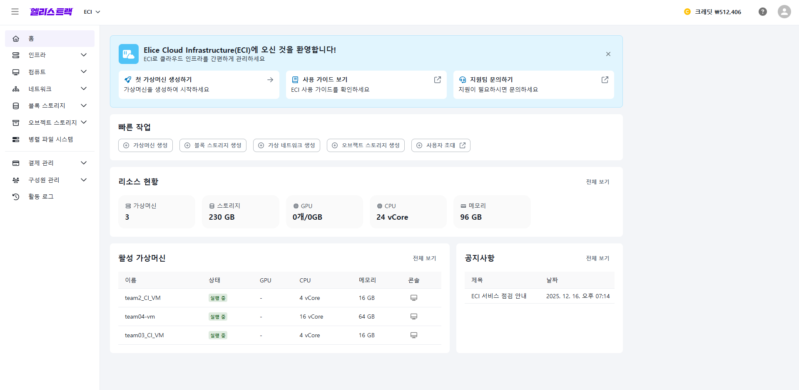
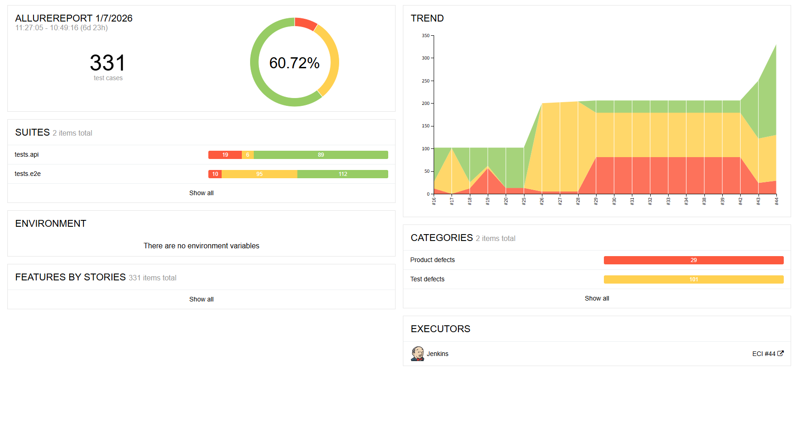

# 🐞 Bug404 🐞

엘리스의 클라우드 인프라 서비스인 Elice Cloud Infrastructure(ECI)를 대상으로 Google Cloud와 Jenkins CI 연동을 통해

✅ **UI E2E 자동화(Selenium + Pytest, POM)**  
✅ **API 테스트 자동화(requests 기반 Pytest)**  
✅ **JMeter 성능 테스트 자동 실행**  
✅ **Allure Report 생성** 

까지 한 번에 수행해주는 테스트 자동화 프로젝트입니다.

## 🧱 Tech Stack
- Python / Pytest
- Selenium WebDriver (Chrome)
- requests (API)
- Jenkins (on Google Cloud VM)
- Apache JMeter
- Allure Report

## 🎯 Target Under Test


- **Site**: Elice Cloud Infrastructure
- **UI URL**: `https://qatrack.elice.io/eci`
- **API Base URL**: `https://portal.gov.elice.cloud/api`

## 📁 Project Structure
```bash
.
├─ images/                      # README/문서용 이미지(스크린샷 등)
├─ performance/                 # JMeter 기반 성능 테스트 자원 및 결과
│  ├─ data/                     # JMeter에서 사용하는 입력 데이터
│  ├─ report_50/                # JMeter HTML 리포트(예: 50회 실행 결과)
│  ├─ team4.jmx                 # JMeter 테스트 플랜
│  ├─ result_50.jtl             # JMeter 실행 결과 로그
│  ├─ setup_resources.py        # 성능 테스트 전 리소스 사전 생성/준비 스크립트
│  └─ validate_result.py        # 성능 결과 검증(임계치/통계 확인 등) 스크립트
├─ reports/                     # 테스트 리포트 산출물(예: screenshots 등)
├─ src/                         # 테스트 프레임워크 및 공통 코드
│  ├─ api/                      # API 테스트 모듈(요청 래퍼, fixture, 리소스 생성 유틸)
│  ├─ auth/                     # 인증/토큰 처리(get_token 등)
│  ├─ config/                   # 환경/설정 파일(config.ini 등)
│  ├─ pages/                    # UI 테스트 POM(Page Object Model)
│  └─ utils/                    # 로케이터/공통 유틸(대기, 파서 등)
├─ tests/                       # 실제 pytest 테스트 코드
│  ├─ api/                      # API 테스트 케이스
│  └─ e2e/                      # UI E2E 테스트 케이스(+ e2e 전용 conftest)
├─ Dockerfile                   # 컨테이너 실행 환경 정의(CI/로컬 통일용)
├─ Jenkinsfile                  # Jenkins 파이프라인 정의(테스트/리포트/JMeter 자동화)
├─ pytest.ini                   # pytest 설정(마커 등록, 옵션 등)
├─ requirements.txt             # Python 의존성
└─ README.md                    # 프로젝트 문서
```

## ✅ Key Features

### - API Tests (Pytest + requests)
- CRUD Test (생성/조회/수정/삭제)

  **ex) 컴퓨트 > 가상머신**

      생성(POST 요청으로 가상머신이 생성되는 지 검증)
      수정(PATCH 요청으로 가상머신의 이름이 수정되는 지 검증)
      삭제(DELETE 요청으로 가상머신의 삭제를 검증)

- `tests/conftest.py`의 resource_manager 픽스쳐를 활용하여 생성된 리소스 자동 삭제

### - UI E2E Tests (Selenium + Pytest)

- 홈페이지 사이드바에 있는 인프라, 컴퓨트 등 각 메뉴들에 해당하는 기능들이 잘 동작하는 지 검증

  **ex) 컴퓨트 > 가상머신**

      생성(화면상에서 필수설정값들을 입력하며 가상머신이 생성되는 동작 검증)
      수정(이름 변경 후 상세 화면 텍스트 반영 검증)
      삭제(네트워크 인터페이스 삭제 옵션 체크 + 동의 체크 + 삭제 검증)


### - Performance (JMeter)
- Jenkins에서 `.jmx` 플랜 자동 실행
- `.jtl` 결과 및 HTML Report 생성

### - Reporting
- Allure 결과 생성 및 Jenkins에서 Report 확인 가능

### - 로그인시 토큰값 받아오기
- `src/auth/get_token.py` 활용하여 토큰값 받아옴
- 받아온 토큰값을 .txt 파일로 저장하여 jmeter 테스트때 활용

## ⚙️ Prerequisites
- Python 3.14
- Google Chrome / ChromeDriver (CI에서는 headless 사용 가능)
- (선택) Allure CLI
- (선택) JMeter (로컬 실행 시)

## 🔐 환경 변수 설정 (.env)
프로젝트 루트에 .env 파일을 생성하고 다음과 같이 설정합니다.
```bash
ECI_ID= ...
ECI_PASSWORD= ...

ZONE_ID= ...
API_BASE_URL= ...
```

## 🚀 Run 
### 1) 설치
```bash
python -m venv .venv
# Windows
.venv\Scripts\activate
# macOS/Linux
source .venv/bin/activate

pip install -r requirements.txt
```

### 2) Docker로 실행
```bash
docker build -t bug404  . 
docker run --rm bug404
```

## 🚀 Jmeter Run
```bash
jmeter -n \
  -t team4.jmx \
  -l result50.jtl \
  -e -o report50 \
```

## 🤖 Jenkins CI Flow

Jenkins 파이프라인에서 아래 순서로 실행됩니다.

1. Checkout

2. Prepare .env (Credentials → .env 생성)

3. Run API Test (docker-compose up api-test)

4. Run E2E Test (docker-compose up e2e-test)

5. Post: Allure/HTML Publish + Artifacts + docker-compose down

## 🔬 테스트 결과 요약
- API 테스트: 90개 PASSED 9개 FAILED
- UI E2E 테스트: 134개 PASSED 8개 FAILED

## 📊 Reports

- Allure



Jenkins Allure 플러그인으로 빌드별 리포트 확인

- Jmeter


로컬환경에서 실행 후 확인 가능

## ⭐ 트러블슈팅

### - Negative API Test가 공용 api_method에서 즉시 실패하는 문제

- ### 문제

공용 API 헬퍼(`src/api/api_method.py`)를 적용한 뒤, 의도적으로 4xx/5xx를 기대하는 네거티브 테스트가 실패했습니다. 

원인은 테스트 코드에서 상태 코드를 검증하기 전에, 공용 헬퍼 내부에서 예외가 먼저 발생했기 때문입니다.

- ### 원인

api_request()에서 response.ok를 기준으로 실패 응답(4xx/5xx)을 감지하면 즉시 AssertionError를 발생시키도록 구현되어 있었습니다.

response.ok == False : 4xx/5xx 응답

기존 구현: 4xx/5xx 응답 시 바로 예외 발생 → 네거티브 테스트에서 status code 검증 불가

- ### 해결

실패 응답도 정상적으로 반환받아 검증할 수 있도록 raise_on_error 옵션을 추가했습니다.

기본값은 raise_on_error=True로 유지하여 Positive 테스트에서는 기존처럼 빠르게 실패 원인을 확인 가능

Negative 테스트에서는 raise_on_error=False로 호출하여 4xx/5xx 응답을 그대로 반환받아 status_code 및 응답 body를 검증하도록 개선했습니다.
## ⌛ 프로젝트 기간
2025년 12월 19일 ~ 2026년 1월 7일

